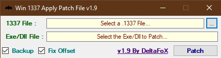

# 说明

该补丁消除了 Nvidia 对消费级 GPU 施加的最大同时 NVENC 视频编码会话数的限制。使用补丁的版本取决于操
作系统，Nvidia驱动程序版本等。这个文档只记录了Windows操作系统内安装该补丁的过程。

# 操作步骤

1. 下载最新版的驱动安装工具-[Win_1337_Apply_Patch](https://github.com/Deltafox79/Win_1337_Apply_Patch/releases/latest)。
2. 查看操作系统的nvidia驱动的版本，然后在在浏览器上访问[version-table](https://github.com/keylase/nvidia-patch/tree/master/win#version-table)，找到驱动对应的版本，目前应
该没有32位的操作系统了，所以我们需要64位的补丁，具体操作：在`x64 library patch`上鼠标右击，选择**另存为**，这样会在本地生成一个名为`nvencodeapi64.1337`的补丁文件。
3. 关闭所有使用GPU的程序。
4. 运行驱动安装工具--`Win_1337_Apply_Patch`， 选择刚才下载好的`1337File`，然后
在`%WINDIR%\system32`内选择 `nvencodeapi64.dll`，将补丁打入到dll。
5. 如果安装失败，需要检查关闭所有使用 `nvencodeapi64.dll` 的应用程序。

# 参考资料

- [windows补丁](https://github.com/keylase/nvidia-patch/tree/master/win)
- [windows补丁版本列表](https://github.com/keylase/nvidia-patch/tree/master/win#version-table)
- [linux补丁](https://github.com/keylase/nvidia-patch)
